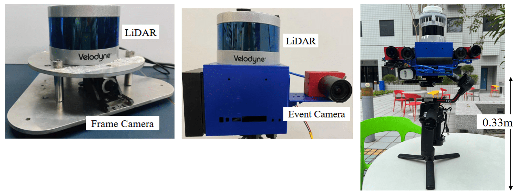

<!-- PROJECT LOGO -->

<p align="center">
  <h2 align="center">LCE-Calib: Automatic LiDAR-Frame/Event Camera Extrinsic Calibration With A Globally Optimal Solution</h2>
  <p align="center">
    <a href="https://https://gogojjh.github.io"><strong>Jianhao Jiao*</strong></a>
    ·
    <a><strong>Feiyi Chen*</strong></a>
    ·
    <a><strong>Hexiang Wei</strong></a>
    ·
    <a href="https://zarathustr.github.io/"><strong>Jin Wu</strong></a>
    ·
    <a href="https://facultyprofiles.hkust.edu.hk/profiles.php?profile=ming-liu-eelium"><strong>Ming Liu</strong></a>
    · 
    <a><strong>(* Equal Contribution)</strong></a>  
  </p>
  <h4 align="center">Under Review</h4>
  <div align="center"></div>

## Installation

First you have to install the MATLAB (our code has been tested with MATLAB R2019b, but the code of running the baseline method should be tested with >= MATLAB R2021b).

1. You need to download the preliminary QPEP (LCECalib wrapper)

```
git clone https://github.com/HKUSTGZ-IADC/LibQPEP-LCECalib
```

2. You need to download the preliminary E2VID for image reconstruction from events if needed. 
```
git clone https://github.com/HKUSTGZ-IADC/E2Calib-LCECalib
```

3. Download the repository of LCECalib
```
git clone https://github.com/HKUSTGZ-IADC/LCECalib
```

4. (Optional) I recommend you to use the code in docker. 
```
docker pull iidcramlab/e2vid:cuda10.1-conda-py3
nvidia-docker run -v <your_path>:<docker_path> --it --name e2vid iidcramlab/e2vid:cuda10.1-conda-py3 /bin/bash
```

## Dataset Preparation

We provide data used in our paper here: http://gofile.me/72EEc/OK6HMnQeH. Please download and store them according to below folder structure

* simu_data_bias/
  * simu_data_1 - simu_data_10: simulated data at the noise levels from 1-10
* real_data/
  * real_data_1 - real_data_3: *RLFS01* - *RLFS03*
  * real_data_4 - real_data_9: *RLES01-LF*, *RLES01-LE*, *RLES02-LF*, *RLES02-LE*, *RLES03-LF*, *RLES03-LE*

You can collect data by yourself for practical sensors, two tricks are provided:
* The checkboard should be far away from its holder (like the human) to make the plane fitting clear
* The checkboard should be placed as shown in the paper for the successful boundary detection

## Run

### Calibration on data presented in our paper

* Please set correct ```data_type``` and ```data_option``` in ```run_lcecalib_qpep.m```
* Please set the flag ```save_result_flag``` and ```plot_result_flag``` in ```run_lcecalib_qpep.m```
* Run ```run_lcecalib_qpep.m```
  * if ```plot_result_flag=1```, the code will show simiar results to Fig.8, FIg.10, and Fig.12 in our paper.
  * if ```save_result_flag=1```, results provided by inner modules of LCECalib will be stored for analysis.

### Calibration on self-collected data

* Please set correct ```data_type``` and ```data_option``` in ```run_lcecalib_qpep_other_data.m```
* Please set the flag ```save_result_flag``` and ```plot_result_flag``` in ```run_lcecalib_qpep_other_data.m```
* Run ```run_lcecalib_qpep_other_data.m```

### Calibration using the baseline method
We provide the code of running the baseline method, which is based on the [MATLAB implementation](https://ww2.mathworks.cn/help/lidar/ug/lidar-and-camera-calibration.html?requestedDomain=cn).
* Please set correct ```all_data_type``` and ```data_option``` in ```run_baseline_zhou.m```
* Run ```run_baseline_zhou.m```

## Demo

### Calibration device
<p align="center">
	
</p>

### Reconstructed images from events
<p align="center">
	
	
	
    <center><font size="5">Pure Events</font></center>
</p>
<p align="center">
	
	
	
	<center><font size="5">Reconstructed Images</font></center>
</p>

### Projecting points onto images with calibrated extrinsics
<p align="center">
	
    <br>
	
	
	<center><font size="5">Camera-VLP16 Calibration</font></font></center>
</p>
<p align="center">
	
	
    <center><font size="5">Camera-Ouster128 Calibration</font></center>
</p>


## Acknowledgement
The authors would like to thank members in HKUST Robotics Institute and Shenzhen Unity-Drive innoviation for the help and suggestions in algorithm development.

## Citation
If you find our code or paper useful, please cite

## Contact
Contact [Jianhao Jiao](mailto:jiaojh1994@gmail.com) for questions, comments and reporting bugs.