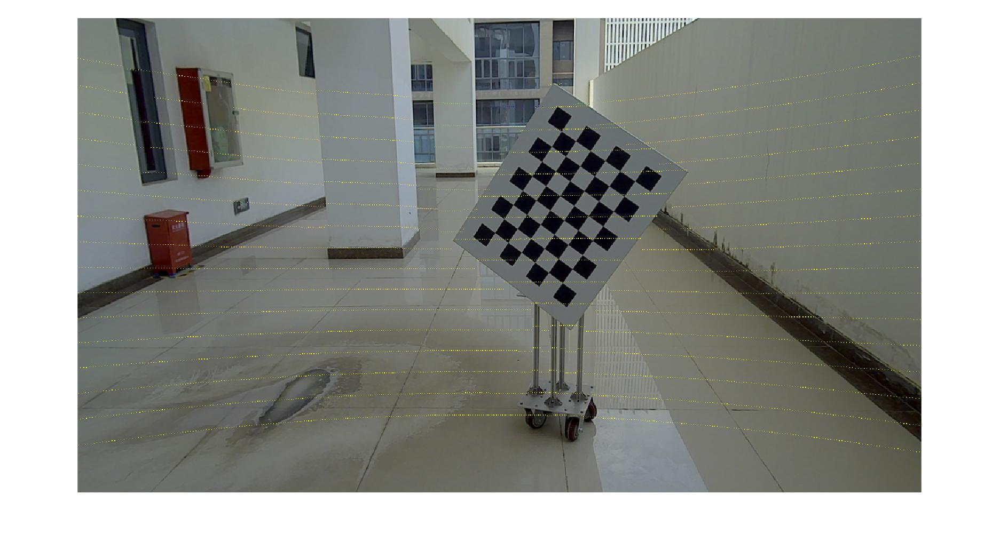
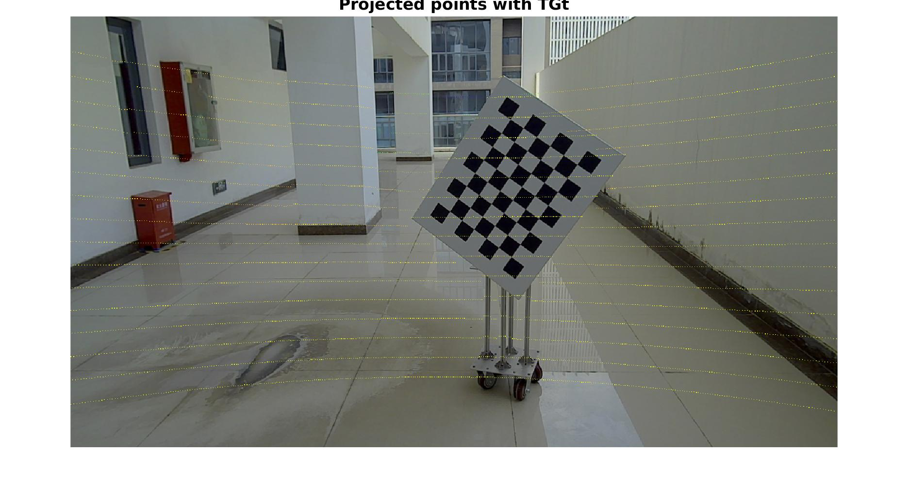

## Experiment Results ------ 20220318

### Pipeline of QPEP-LCEcalib

1. Extract **pattern points from images** and **board, edge points from LiDARs**
2. Compute the board transformation w.r.t. the camera frame using QPEP-PnP
3. Compute the board planar coefficient: [n;d]
4. Compute the initial transformation from the camera to LiDAR by performing a point-to-plane registration using QPEP-PToP: T_ini
5. With multiple iterations: for i = 1:max_iterations (i.e., 5)
6. |------------------ With T_ini, we find corresponding edge for each LiDAR edge point
7. |------------------ Compute T_ref by performing a point-to-plane registration using QPEP-PToP       

### Covariance of quaternion from QPEP-PnP

1. The computed covariance does not fit well with Monte Carlo sampling

 

### Covariance of quaternion from QPEP-PTop

1. The computed covariance fits well with Monte Carlo sampling

 

### Extrinsic Calibration Results

1. Estimated extrinsics against GT
   * Rotation error: 0.6078 *deg*
   * Translation error: 0.0189 *m*

2. Projected point cloud: LiDAR points are not perfectly aligned onto the image

 **estimated extrinsics**

**GT extrinsics**

3. Visualization of planar LiDAR point cloud on the checkerboard in camera frame

### Issues of Current Solutions

1. The rotation error does not reduce --- a bottleneck -> solution: analyze the point-to-plane error equation
   1. S1: project checkerboard point in camera onto the checkerboard plane 
   2. S2: model the uncertainty of the normal

